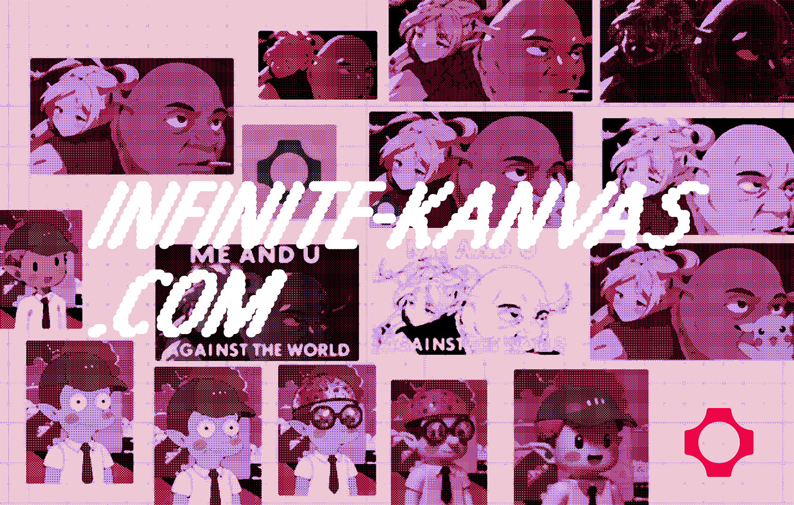

# Infinite Kanvas



An infinite canvas image editor with AI transformations using fal.ai. Built with Next.js, React Konva, and tRPC.

## Features

- Infinite canvas with pan/zoom
- Drag & drop image upload
- AI style transfer via Flux Kontext LoRA
- Background removal and object isolation
- Real-time streaming of AI results
- Multi-selection and image manipulation
- Auto-save to IndexedDB
- Undo/redo support

## Technical Details

### Canvas

React Konva for 2D canvas rendering with viewport culling for performance.

### fal.ai Integration

The app integrates with fal.ai's API in several clever ways:

#### 1. Proxy Architecture

To bypass Vercel's 4.5MB request body limit, we implement a proxy pattern:

```typescript
// Client uploads through proxy
const uploadResult = await falClient.storage.upload(blob);

// Proxy endpoint at /api/fal handles the request
export const POST = route.POST; // fal.ai's Next.js proxy
```

This allows users to upload large images that would otherwise be rejected by Vercel's edge runtime.

#### 2. Rate Limiting

The application implements a three-tier rate limiting system for users without API keys:

```typescript
const limiter = {
  perMinute: createRateLimiter(5, "60 s"), // 10 requests per minute
  perHour: createRateLimiter(15, "60 m"), // 30 requests per hour
  perDay: createRateLimiter(50, "24 h"), // 100 requests per day
};
```

Users can bypass rate limits by adding their own fal.ai API key, which switches them to their own quota.

#### 3. Real-time Streaming

Image generation uses fal.ai's streaming API to provide live updates:

```typescript
// Server-side streaming with tRPC
const stream = await falClient.stream("fal-ai/flux-kontext-lora", {
  input: { image_url, prompt, loras },
});

for await (const event of stream) {
  yield tracked(eventId, { type: "progress", data: event });
}
```

The client receives these updates via a tRPC subscription and updates the canvas in real-time, creating a smooth user experience where images gradually appear as they're being generated.

### State Management

The application uses a combination of React state and IndexedDB for persistence:

- **Canvas State**: Images, positions, and transformations stored in React state
- **History**: Undo/redo stack maintained in memory
- **Persistence**: Auto-saves to IndexedDB with debouncing
- **Image Storage**: Original image data stored separately in IndexedDB to handle large files

### API Architecture

Built with tRPC for type-safe API calls:

- `removeBackground`: Uses fal.ai's Bria background removal model
- `isolateObject`: Leverages EVF-SAM for semantic object segmentation
- `generateTextToImage`: Text-to-image generation with Flux
- `generateImageStream`: Streaming image-to-image transformations

## How AI Features Work

### Style Transfer

Uses fal.ai's Flux Kontext LoRA model to apply artistic styles:

1. User selects an image and a style (or provides custom LoRA URL)
2. Image is uploaded to fal.ai storage via proxy
3. Streaming transformation begins, updating canvas in real-time
4. Final high-quality result replaces the preview

### Object Isolation

Powered by EVF-SAM (Enhanced Visual Foundation Segment Anything Model):

1. User describes object in natural language (e.g., "the red car")
2. EVF-SAM generates a segmentation mask
3. Server applies mask to original image using Sharp
4. Isolated object with transparent background returned to canvas

### Background Removal

Uses Bria's specialized background removal model:

1. Automatic subject detection
2. Clean edge preservation
3. Transparent PNG output

## Performance Optimizations

- **Viewport Culling**: Only renders visible images
- **Streaming Images**: Custom hook prevents flickering during updates
- **Debounced Saving**: Reduces IndexedDB writes
- **Image Resizing**: Automatically resizes large images before upload
- **Lazy Loading**: Default images load asynchronously

## Development

### Setup

1. Clone the repository
2. Install dependencies: `pnpm install`
3. Add your fal.ai API key to `.env.local`:

   ```
   FAL_KEY=your_fal_api_key_here
   NEXT_PUBLIC_APP_URL=http://localhost:3000

   # Optional
   KV_REST_API_URL=
   KV_REST_API_TOKEN=
   ```

4. Run development server: `pnpm run dev`

### Pre-commit Hooks

The project uses [Husky](https://github.com/typicode/husky) and [lint-staged](https://github.com/lint-staged/lint-staged) for automated code formatting and linting before commits.

Pre-commit hooks are automatically installed when you run `pnpm install` (via the `prepare` script).

The hooks will:

- Run Prettier formatting on staged files
- Run ESLint with auto-fix on staged files
- Only process files that are staged for commit (more efficient than processing all files)

If you need to manually run the pre-commit checks:

```bash
npx lint-staged
```

### Tech Stack

- **Next.js 15**: React framework with App Router
- **React Konva**: Canvas rendering engine
- **tRPC**: Type-safe API layer
- **fal.ai SDK**: AI model integration
- **Tailwind CSS**: Styling
- **IndexedDB**: Client-side storage
- **Sharp**: Server-side image processing

## Deployment

The app is optimized for Vercel deployment:

- Uses edge-compatible APIs
- Implements request proxying for large files
- Automatic image optimization disabled for canvas compatibility
- Bot protection via BotId integration

## License

MIT
